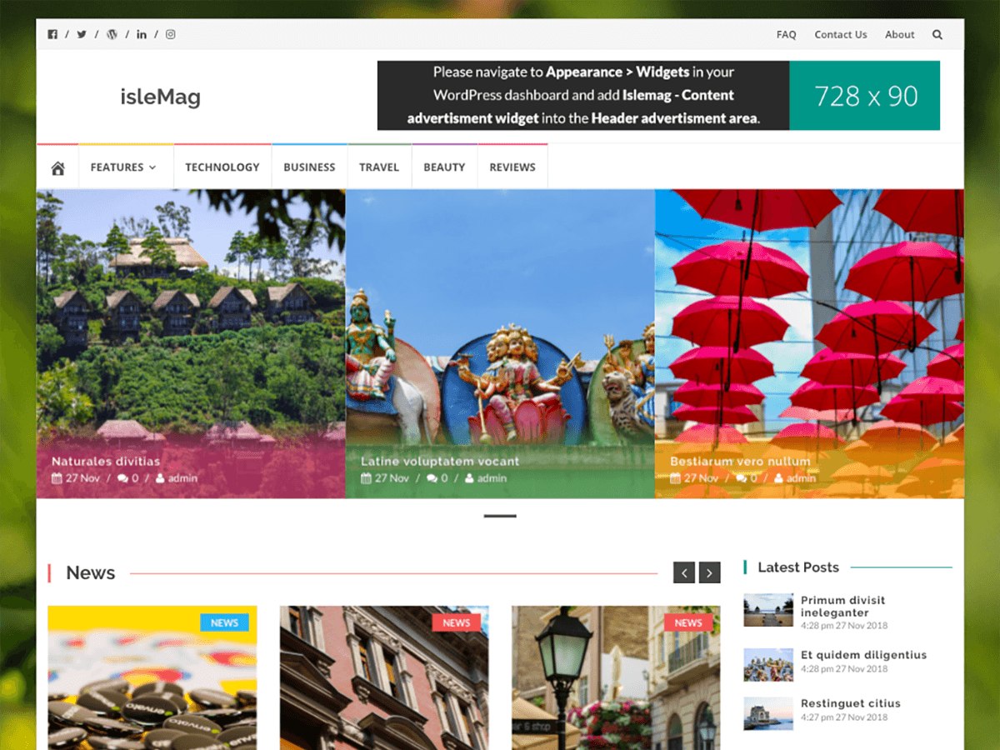

# IsleMag

A modern and clean free WordPress theme for magazines, news and media websites, personal blogs, or photography. IsleMag is responsive, flat, minimalist, SEO friendly, Retina ready, built with Bootstrap, and has social links. The theme has Google AdSense banners, a featured slider, custom backgrounds, filtered categories, tags, boxed layout, and drop-down menu. IsleMag also offers well-structured content and posts, multiple sidebars and widgets. The theme is highly customizable and translation ready.

**Requires at least:** 4.0

**Tested up to:** 4.6.1

**Tags:** `two-columns`, `three-columns`, `right-sidebar`, `custom-background`, `custom-colors`, `custom-menu`, `featured-images`, `full-width-template`, `post-formats`, `sticky-post`, `theme-options`, `threaded-comments`, `translation-ready`, `portfolio`, `blog`

## Installation

1. In your admin panel, go to Appearance > Themes and click the Add New button.
2. Click Upload and Choose File, then select the theme's .zip file. Click Install Now.
3. Click Activate to use your new theme right away.

## License

IsleMag WordPress theme, Copyright © 2015-2016 [Themeisle.com](http://themeisle.com/).

IsleMag WordPress theme is licensed under the GPL3.

Unless otherwise specified, all the theme files, scripts and images are licensed under GNU General Public License.

The exceptions to this license are as follows:
- [Font Awesome Iconpicker from repeater](https://github.com/itsjavi/fontawesome-iconpicker) - [License](https://github.com/itsjavi/fontawesome-iconpicker/blob/master/LICENSE)
- [Bootstrap v3.3.5](http://getbootstrap.com) - [License](https://github.com/twbs/bootstrap#copyright-and-license)
- [Owl Carousel](https://github.com/OwlCarousel2/OwlCarousel2) - [License](https://github.com/OwlCarousel2/OwlCarousel2/blob/develop/LICENSE)
- [Font Awesome](https://github.com/FortAwesome/Font-Awesome) - [License](https://github.com/FortAwesome/Font-Awesome#license)
- [My Stock Photos](http://mystock.photos/) - [License](http://mystock.photos/license/)
  - http://mystock.photos/bikes/
  - http://mystock.photos/red-leafs/
  - http://mystock.photos/tourists/
  - http://mystock.photos/skater/
  - http://mystock.photos/yellow-tent/
  - http://mystock.photos/green-window/
